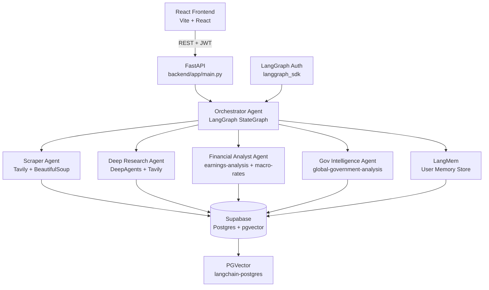

# Paparan.ai — Backend Implementation Plan
> Generated: 2026-04-24 | Python multi-agent backend using LangGraph + DeepAgents

---

## Overview

Build a Python backend inside the existing `paparan-ai` monorepo under `backend/`. The backend is a LangGraph multi-agent system that scrapes ASEAN policy intelligence from tiered news sources, stores everything in Supabase (with pgvector semantic search), and exposes a FastAPI interface for the React frontend. Deployed to Railway.

## Architecture



## Monorepo Structure

```
paparan-ai/                          ← existing repo root
├── src/                             ← existing React frontend (unchanged)
├── backend/                         ← NEW Python backend
│   ├── app/
│   │   ├── main.py                  ← FastAPI app + routes
│   │   ├── config.py                ← env vars, source tier config
│   │   ├── agents/
│   │   │   ├── orchestrator.py      ← top-level LangGraph orchestrator
│   │   │   ├── scraper.py           ← feed ingestion agent
│   │   │   ├── researcher.py        ← deep research agent (DeepAgents)
│   │   │   ├── analyst.py           ← financial analyst agent
│   │   │   └── gov_intel.py         ← government intelligence agent
│   │   ├── tools/
│   │   │   ├── tavily_tools.py      ← Tavily search + webpage fetch
│   │   │   ├── supabase_tools.py    ← cache read/write tools
│   │   │   └── skills_loader.py     ← load Claude Code skills as prompts
│   │   ├── db/
│   │   │   ├── client.py            ← Supabase singleton client
│   │   │   ├── vector_store.py      ← LangChain PGVector stores
│   │   │   └── schema.py            ← Pydantic models for all tables
│   │   └── security/
│   │       └── auth.py              ← LangGraph Auth resource-level access control
│   ├── supabase/
│   │   └── migrations/
│   │       └── 002_feed_cache.sql   ← feed_items + agent_memory tables
│   ├── pyproject.toml
│   ├── railway.toml
│   ├── Procfile
│   └── .env.example
├── package.json                     ← existing (unchanged)
└── README.md                        ← existing (unchanged)
```

## News Source Tiers

```python
# backend/app/config.py
PRIMARY_SOURCES = [
    "parliament.gov.my", "parliament.gov.sg", "dpr.go.id",
    "bi.go.id", "asean.org", "worldbank.org", "imf.org",
    "congress.gov.ph", "senate.gov.ph", "quochoi.vn",
    "parliament.go.th", "agc.gov.sg"
]
TIER1_SOURCES = [
    "reuters.com", "apnews.com", "bloomberg.com", "ft.com"
]
INDONESIA_SOURCES = [
    "antaranews.com", "kontan.co.id", "bisnis.com", "ojk.go.id"
]
ISLAMIC_WEB3_SOURCES = [
    "salaamgateway.com", "coindesk.com", "theblock.co"
]
```

## Skills Used

| Skill | Source | Used By |
|---|---|---|
| `earnings-analysis` | `anthropics/financial-services-plugins` | Analyst Agent |
| `macro-rates-monitor` | `anthropics/financial-services-plugins` | Analyst Agent |
| `equity-research` | `anthropics/financial-services-plugins` | Analyst Agent |
| `competitive-analysis` | `anthropics/financial-services-plugins` | Analyst Agent |
| `global-government-analysis` | `hack23/riksdagsmonitor` | Gov Intel Agent |

Install:
```bash
npx skills add anthropics/financial-services-plugins
npx skills add https://github.com/hack23/riksdagsmonitor --skill global-government-analysis
```

---

## Task Breakdown

### Task 1: Monorepo backend scaffold

**Objective:** Add `backend/` to the existing `paparan-ai` repo with Python project structure.

**Implementation:**
- `backend/pyproject.toml`:
  ```toml
  [project]
  name = "paparan-backend"
  version = "0.1.0"
  requires-python = ">=3.11"
  dependencies = [
    "langgraph", "langgraph-sdk", "deepagents",
    "langchain-anthropic", "langchain-community", "langchain-postgres",
    "langmem", "tavily-python", "fastapi", "uvicorn[standard]",
    "supabase", "psycopg[binary]", "httpx", "markdownify",
    "python-dotenv", "pydantic"
  ]
  ```
- `backend/.env.example`:
  ```
  ANTHROPIC_API_KEY=
  TAVILY_API_KEY=
  SUPABASE_URL=
  SUPABASE_ANON_KEY=
  SUPABASE_SERVICE_ROLE_KEY=
  DATABASE_URL=postgresql+psycopg://...
  LANGSMITH_API_KEY=
  LANGSMITH_TRACING=true
  FRONTEND_URL=
  ```
- Add to root `.gitignore`: `backend/__pycache__/`, `backend/.venv/`, `backend/*.egg-info/`

**Demo:** `cd backend && pip install -e . && python -c "import app"` succeeds.

---

### Task 2: Supabase client + schema extension

**Objective:** Python Supabase client and extended schema for feed cache and agent memory.

**Implementation:**
- `backend/app/db/client.py` — singleton Supabase client:
  ```python
  from supabase import create_client
  from app.config import settings

  _client = None
  def get_client():
      global _client
      if not _client:
          _client = create_client(settings.SUPABASE_URL, settings.SUPABASE_SERVICE_ROLE_KEY)
      return _client
  ```
- `backend/supabase/migrations/002_feed_cache.sql`:
  ```sql
  CREATE TABLE feed_items (
    id UUID PRIMARY KEY DEFAULT gen_random_uuid(),
    title TEXT, summary TEXT, url TEXT UNIQUE,
    source TEXT, region TEXT, topic_tags TEXT[],
    published_at TIMESTAMPTZ, retrieved_at TIMESTAMPTZ DEFAULT NOW(),
    embedding vector(1536), expires_at TIMESTAMPTZ
  );
  CREATE TABLE agent_memory (
    id UUID PRIMARY KEY DEFAULT gen_random_uuid(),
    user_id UUID REFERENCES users(id),
    memory_type TEXT,
    content JSONB, created_at TIMESTAMPTZ DEFAULT NOW()
  );
  CREATE INDEX idx_feed_embedding ON feed_items USING ivfflat(embedding vector_cosine_ops);
  CREATE INDEX idx_feed_url ON feed_items(url);
  CREATE INDEX idx_feed_expires ON feed_items(expires_at);
  ```
- `backend/app/db/schema.py` — Pydantic models for `FeedItem`, `AgentMemory`, `PaparanReport`

**Demo:** Can insert and query a `feed_item` row from Python.

---

### Task 3: Supabase cache tools

**Objective:** `@tool`-decorated functions agents use to read/write Supabase — prevents redundant API calls.

**Implementation:**
- `backend/app/tools/supabase_tools.py`:
  - `check_feed_cache(url: str) -> Optional[FeedItem]` — returns item if `expires_at > now()`
  - `save_feed_item(item: FeedItem)` — upsert by URL, `expires_at = now() + 24h`
  - `save_paparan_report(report: dict)` — insert into `paparan_reports`
  - `get_user_memory(user_id: str) -> list`
  - `save_user_memory(user_id: str, memory_type: str, content: dict)`

**Demo:** Cache hit returns cached item; expired item returns None.

---

### Task 3a: LangChain PGVector vector store

**Objective:** `langchain-postgres` `PGVector` as the canonical semantic search layer over Supabase.

**Implementation:**
- `backend/app/db/vector_store.py`:
  ```python
  from langchain_postgres import PGVector
  from langchain_anthropic import AnthropicEmbeddings
  from app.config import settings

  embeddings = AnthropicEmbeddings(model="voyage-3")

  feed_store = PGVector(
      embeddings=embeddings,
      collection_name="feed_items",
      connection=settings.DATABASE_URL,
  )

  document_store = PGVector(
      embeddings=embeddings,
      collection_name="documents",
      connection=settings.DATABASE_URL,
  )
  ```
- Add `@tool` `semantic_search(query, region, limit)` in `supabase_tools.py` calling `feed_store.similarity_search_with_score()`
- `feed_store.add_documents(docs)` called by scraper after ingestion
- `document_store.similarity_search(query)` used for uploaded document RAG

**Demo:** `feed_store.similarity_search("ASEAN digital economy regulation")` returns ranked `Document` objects.

---

### Task 4: Tavily + scraper tools

**Objective:** Web search and scraping tools with source-tier awareness.

**Implementation:**
- `backend/app/tools/tavily_tools.py`:
  - `tavily_search(query, topic, max_results)` — Tavily search + httpx fetch + markdownify
  - `fetch_webpage(url)` — standalone fetcher
  - `scrape_source_tier(source_name, query)` — routes to correct Tavily `topic`:
    - Primary/gov → `"general"`, Tier 1 news → `"news"`, Financial/Islamic/Web3 → `"finance"`

**Demo:** `scrape_source_tier("reuters", "ASEAN trade policy 2026")` returns structured results.

---

### Task 5: Skills loader

**Objective:** Load Claude Code skills as system prompt fragments injected into agent prompts.

**Implementation:**
- `backend/app/tools/skills_loader.py`:
  - `get_skill_prompt(skill_name: str) -> str` — reads installed skill's `SKILL.md`
- `backend/scripts/install_skills.sh`:
  ```bash
  npx skills add anthropics/financial-services-plugins
  npx skills add https://github.com/hack23/riksdagsmonitor --skill global-government-analysis
  ```

**Demo:** `get_skill_prompt("earnings-analysis")` returns skill instructions as a string.

---

### Task 6: Scraper Agent (LangGraph)

**Objective:** Scheduled agent that ingests feed items from all source tiers into Supabase.

**Implementation:**
- `backend/app/agents/scraper.py` — LangGraph `StateGraph`:
  ```
  START → check_cache → scrape → embed → save → END
  ```
- State: `{ sources_to_scrape: list, scraped_items: list, saved_count: int }`
- `check_cache` skips URLs with valid `expires_at`
- `embed` calls `feed_store.add_documents(docs)`
- `save` upserts via `save_feed_item` with 24h TTL

**Demo:** Scraper populates `feed_items` with real ASEAN policy articles.

---

### Task 7: Gov Intelligence Agent (LangGraph)

**Objective:** Specialized agent for government/parliamentary data.

**Implementation:**
- `backend/app/agents/gov_intel.py`
- System prompt: `get_skill_prompt("global-government-analysis")`
- Tools: `tavily_search(topic="general")`, `semantic_search`, `save_feed_item`
- Queries per country: `"{country} parliament bill 2026"`, `"{country} regulatory announcement 2026"`
- Countries: Malaysia, Singapore, Indonesia, Thailand, Philippines, Vietnam + ASEAN regional

**Demo:** Returns structured gov intelligence items tagged with `region`, `source`, `topic_tags`.

---

### Task 8: Financial Analyst Agent (LangGraph)

**Objective:** Specialized agent for financial/regulatory policy.

**Implementation:**
- `backend/app/agents/analyst.py`
- System prompt: `earnings-analysis` + `macro-rates-monitor` + `equity-research` + `competitive-analysis` skills
- Tools: `tavily_search(topic="finance")`, `semantic_search`, `save_feed_item`
- Sources: `ojk.go.id`, `bi.go.id`, `salaamgateway.com`, `coindesk.com`, `theblock.co`
- Output `impact`: `HIGH` / `MEDIUM` / `LOW` matching existing `Paparan` TS type

**Demo:** Returns financial policy items with impact classification and citations.

---

### Task 9: Deep Research Agent (DeepAgents)

**Objective:** On-demand deep research for brief generation using sub-agent delegation.

**Implementation:**
- `backend/app/agents/researcher.py` using `deepagents` library
- Parallel sub-agents per dimension: political, economic, regulatory, stakeholder
- Each sub-agent: `tavily_search` → `fetch_webpage` → findings with citations
- Cache-first: calls Tavily only if `similarity_search_with_score()` top score < 0.85
- Output matches `Paparan` TypeScript schema:
  ```
  executiveSummary, currentSituation, developments[],
  implications, risks[], opportunities[], actions[], sources[]
  ```

**Demo:** `researcher.run("ASEAN digital economy regulation 2026")` returns a fully cited structured brief.

---

### Task 10: Orchestrator Agent + LangMem

**Objective:** Top-level LangGraph orchestrator routing requests and managing cross-session user memory.

**Implementation:**
- `backend/app/agents/orchestrator.py`:
  ```
  START → load_memory → classify_request → [route] → synthesize → save_report → update_memory → END
  ```
- Routes: `"feed"` → Scraper, `"gov"` → Gov Intel, `"financial"` → Analyst, `"research"` → Researcher
- LangMem namespaces: `(user_id, "preferences")`, `(user_id, "topics")`
- Saves completed report to `paparan_reports` via `save_paparan_report`

**Demo:** User request → orchestrator → sub-agents → Supabase report saved with all sections.

---

### Task 11: FastAPI endpoints

**Objective:** REST API for the React frontend with Supabase JWT auth.

**Implementation:**
- `backend/app/main.py`:
  ```
  POST /api/paparan              — generate brief (triggers orchestrator)
  GET  /api/feed                 — paginated feed_items
  GET  /api/search?q=&region=    — semantic search via feed_store
  POST /api/scrape/trigger       — manually trigger scraper (admin)
  GET  /api/briefs               — list user's paparan_reports
  GET  /api/briefs/{id}          — single report
  POST /api/upload               — upload document → Supabase Storage
  GET  /health                   — Railway health check
  ```
- Auth middleware: validate Supabase JWT from `Authorization: Bearer <token>`
- CORS: allow `FRONTEND_URL`

**Demo:** `POST /api/paparan` with valid JWT returns complete brief JSON matching `Paparan` TS type.

---

### Task 11a: LangGraph resource-level auth (private conversations)

**Objective:** Government-grade isolation — users can only access their own threads, runs, and memory.

**Implementation:**
- `backend/app/security/auth.py`:
  ```python
  from langgraph_sdk import Auth

  auth = Auth()

  @auth.authenticate
  async def authenticate(authorization: str | None):
      # Validate Supabase JWT → return {"identity": user_id}

  @auth.on.threads.create
  async def on_thread_create(ctx, value):
      value.setdefault("metadata", {})["owner"] = ctx.user.identity
      return {"owner": ctx.user.identity}

  @auth.on.threads.read
  async def on_thread_read(ctx, value):
      return {"owner": ctx.user.identity}

  @auth.on.store()
  async def authorize_store(ctx, value):
      assert value["namespace"][0] == ctx.user.identity

  @auth.on.assistants
  async def block_assistants(ctx, value):
      raise Auth.exceptions.HTTPException(status_code=403)
  ```
- Security guarantees:
  - Cross-user thread access returns **404** (not 403) — existence not leaked
  - LangMem store namespace enforced: `(user_id, ...)`
  - Assistants locked to admin only
  - Auth backed by Supabase JWT

**Demo:** User B accessing User A's thread returns 404. User B cannot see User A's memory.

---

### Task 12: Railway deployment

**Objective:** Deploy backend to Railway with daily scraper cron.

**Implementation:**
- `backend/railway.toml`:
  ```toml
  [build]
  builder = "nixpacks"

  [deploy]
  startCommand = "uvicorn app.main:app --host 0.0.0.0 --port $PORT"
  healthcheckPath = "/health"
  healthcheckTimeout = 30
  ```
- `backend/Procfile`: `web: uvicorn app.main:app --host 0.0.0.0 --port $PORT`
- `POST /api/scrape/cron` — Railway cron trigger, `0 22 * * *` UTC (= 06:00 WIB)

**Demo:** `/health` returns `{"status": "ok"}`, scraper cron runs daily at 06:00 WIB.

---

### Task 13: Wire frontend to backend

**Objective:** Replace mock data in React frontend with real API calls.

**Implementation:**
- Add `VITE_API_URL` to frontend `.env`
- `src/services/briefService.ts` — replace in-memory store with `fetch(VITE_API_URL + '/api/briefs')` + Supabase JWT header
- `src/pages/BriefEditorPage.tsx` — call `POST /api/paparan`, show streaming progress
- `src/pages/NewsFeedPage.tsx` — call `GET /api/feed` + `GET /api/search`
- Remove `src/data/mockBriefs.ts` and `src/data/sampleBrief.ts` once live data confirmed

**Demo:** Full stack — React shows real briefs from LangGraph agents, feed shows live ASEAN policy news.

---

## Dependencies

```toml
# backend/pyproject.toml
dependencies = [
  "langgraph",             # Agent orchestration
  "langgraph-sdk",         # Resource-level auth
  "deepagents",            # Deep research sub-agent pattern
  "langmem",               # Cross-session user memory
  "langchain-anthropic",   # Claude + Voyage embeddings
  "langchain-community",
  "langchain-postgres",    # PGVector vector store
  "fastapi",
  "uvicorn[standard]",
  "httpx",
  "markdownify",
  "tavily-python",
  "supabase",
  "psycopg[binary]",       # Required by langchain-postgres
  "python-dotenv",
  "pydantic",
]
```

## Environment Variables

```bash
ANTHROPIC_API_KEY=           # Claude + Voyage embeddings
TAVILY_API_KEY=              # Web search + scraping
SUPABASE_URL=
SUPABASE_ANON_KEY=
SUPABASE_SERVICE_ROLE_KEY=   # Backend only — never expose to frontend
DATABASE_URL=                # postgresql+psycopg://... for PGVector
LANGSMITH_API_KEY=
LANGSMITH_TRACING=true
FRONTEND_URL=                # CORS origin
```

## Milestone Summary

| Task | Deliverable | Effort |
|---|---|---|
| 1 | Monorepo backend scaffold | Low |
| 2 | Supabase client + schema | Low |
| 3 | Cache tools | Low |
| 3a | PGVector vector store | Low |
| 4 | Tavily + scraper tools | Medium |
| 5 | Skills loader | Low |
| 6 | Scraper Agent | Medium |
| 7 | Gov Intelligence Agent | Medium |
| 8 | Financial Analyst Agent | Medium |
| 9 | Deep Research Agent | High |
| 10 | Orchestrator + LangMem | High |
| 11 | FastAPI endpoints | Medium |
| 11a | LangGraph resource auth | Medium |
| 12 | Railway deployment | Low |
| 13 | Frontend wiring | Medium |
